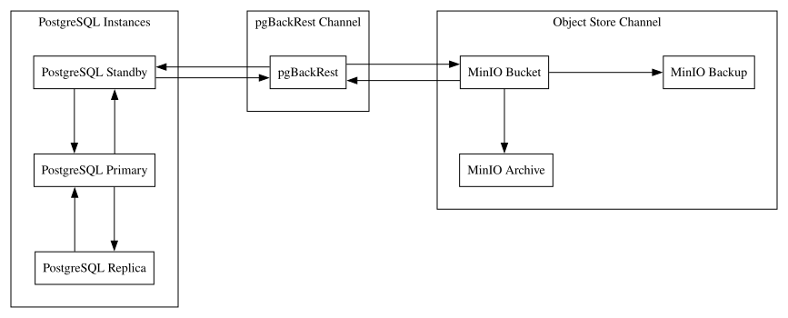

# pgBackRest Guide
## **Rationale**
Backup and restore capabilities are essential for reliable database operations. However, traditional or native database backup methods often rely on full database backups.
As database size grows, backup storage, transfer time, and infrastructure costs also increase.
Native backup approaches may also lack operationally important capabilities such as Point-in-Time Recovery (PITR) and incremental backups, which are critical for restoring databases to a specific state efficiently.
This R&D evaluates the use of `pgBackRest`, an open-source backup and restore tool for PostgreSQL that supports full, differential, incremental backups, and PITR.

## **Core**
### Setup
#### Requirements:
- [Docker/Docker Desktop](https://docs.docker.com/manuals/)
- [PostgreSQL17 Image](https://hub.docker.com/_/postgres)
- [Object Storage (MinIO)](github.com/minio/docs)
- [pgBackRest](https://pgbackrest.org/)

### Configurations
#### _PostgreSQL_
```conf
# pg_hba.conf
host    all         all         <source-cidr> trust
host    replication replicator  <source-cidr> trust
```

```conf
# postgresql.conf

## base
listen_address = '*'
max_connections = 100

## replication
wal_level = replica
max_wal_size = 1GB
min_wal_size = 80MB

## archiving
archive_mode = on
archive_command = 'pgbackrest --stanza=<stanza-name> archive-push %p'
```

#### _pgBackRest_
```conf
[global]
repo1-path=/example/
repo1-bundle=y
repo1-retention-full=2

repo1-type=s3
repo1-s3-bucket=backups
repo1-s3-endpoint=$MINIO_ENDPOINT_URL
repo1-s3-region=us-east-1

repo1-s3-key=$MINIO_ACCESS_KEY
repo1-s3-key-secret=$MINIO_SECRET_KEY

repo1-s3-uri-style=path
repo1-s3-verify-tls=y

log-level-console=detail
log-level-file=debug
compress-level=6
delta=y
start-fast=y

[global:archive-push]
compress-level=6

[main]
pg1-user=root
pg1-path=/var/lib/postgresql/data

pg2-user=postgres
pg2-host-user=root
pg2-host=replica
pg2-path=/var/lib/postgresql/data
```

### Commands
#### Base
```sh
pgbackrest --help
```

#### Creating a _stanza_
```sh
pgbackrest \
    --stanza="<stanza-name>" \
    stanza-create
```

#### Getting the state _info_
```sh
pgbackrest \
    --stanza="<stanza-name>" \
    info
```

#### _Backups_
##### _full_ backup
```sh
pgbackrest \
    --stanza="<stanza-name>" \
    --type="full" \
    backup
```

##### _incremental_ backup
```sh
pgbackrest \
    --stanza="<stanza-name>" \
    --type="incr" \
    backup
```

##### _differential_ backup
```sh
pgbackrest \
    --stanza="<stanza-name>" \
    --type="diff" \
    backup
```

#### _Restore_
##### _full_ restore
```sh
pgbackrest \
    --stanza="<stanza-name>" \
    restore
```

##### specific _backup set_ restore
```sh
pgbackrest \
    --stanza="<stanza-name>" \
    --set="<backup-id>" \
    restore
```

##### _differential_ restore
```sh
pgbackrest \
    --stanza="<stanza-name>" \
    --set="<full-backup-id>_<diff-backup-id>D" \
    restore
```

##### _incremental_ restore
```sh
pgbackrest \
    --stanza="<stanza-name>" \
    --set="<full-backup-id>_<incr-backup-id>I" \
    restore
```

##### _Point-In-Time Recovery (PITR)_ by timestamp
```sh
pgbackrest \
    --stanza="<stanza-name>" \
    --type="time" \
    --target="<timestamp>" \
    restore
```

##### _Point-In-Time Recovery (PITR)_ by transaction ID
```sh
pgbackrest \
    --stanza="<stanza-name>" \
    --type="xid" \
    --target="<xid>" \
    restore
```

##### _Point-In-Time Recovery (PITR)_ by restore point name
```sh
pgbackrest \
    --stanza="<stanza-name>" \
    --type="name" \
    --target="<restore-point-name>" \
    restore
```

##### _Point-In-Time Recovery (PITR)_ by LSN
```sh
pgbackrest \
    --stanza="<stanza-name>" \
    --type="lsn" \
    --target="<lsn>" \
    restore
```

##### _delta_ restore
```sh
pgbackrest \
    --stanza="<stanza-name>" \
    --delta \
    restore
```

##### selected _database_ restore
```sh
pgbackrest \
    --stanza="<stanza-name>" \
    --db-include="<database-name>" \
    restore
```

##### _tablespace_ remapping restore
```sh
pgbackrest \
    --stanza="<stanza-name>" \
    --tablespace-map="<tablespace-name>=<target-path>" \
    restore
```

##### _standby_ restore
```sh
pgbackrest \
    --stanza="<stanza-name>" \
    --type="standby" \
    restore
```

##### _immediate_ restore
```sh
pgbackrest \
    --stanza="<stanza-name>" \
    --type="immediate" \
    restore
```

## **Architecture**


## References 
